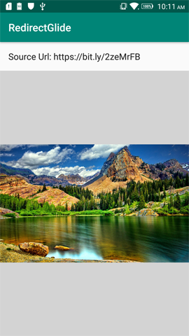

# RedirectGlide :zap:
[](https://android-arsenal.com/details/1/7431)
[](https://android-arsenal.com/api?level=14)
[ ](https://bintray.com/aminography/maven/RedirectGlide/_latestVersion)
  
## **RedirectGlide** empowers [Glide][1] to load images with indirect `URL`s.

Sometimes the images you want to show with `Glide` have indirect link and you should redirect the `URL` to reach the real direct link. **RedirectGlide** is an extension over [Glide's OkHttp3 Integration][2] which adds the redirection functionality to `Glide`.

• **NOTE: Currently it's implemented only for Glide-v4.**

<br/>

Download
--------
Add the following lines to your `build.gradle` file:

```gradle
apply plugin: 'kotlin-android'
apply plugin: 'kotlin-android-extensions'
apply plugin: 'kotlin-kapt'

repositories {
    jcenter()
}
  
dependencies {
    implementation 'com.aminography:redirectglide:2.0.0'
    
    // Glide dependencies
    implementation 'com.github.bumptech.glide:glide:4.9.0'
    kapt 'com.github.bumptech.glide:compiler:4.9.0'
}
```

* If you write code in Java, you should also add kotlin dependency too:
```gradle
dependencies {
    implementation 'org.jetbrains.kotlin:kotlin-stdlib-jdk8:1.3.70'
}
```

<br/>

How to use RedirectGlide?
--------
  
You can simply use **RedirectGlide** by [Glide's generated API][3]. Note that you **should clean and rebuild** your project to create the `GlideApp` class in compile time.

```kotlin
val imageUrl = "https://bit.ly/2zeMrFB"

GlideApp.with(context)
        .load(imageUrl)
        .into(imageView)
```



<br/>

### • Customize the maximum redirection count

The default value for maximum redirection count is set to 5. However you can change it by wrapping the image `URL` with an instance of `RedirectGlideUrl`.

```kotlin
GlideApp.with(context)
        .load(RedirectGlideUrl(imageUrl, 10))
        .into(imageView)
```

<br/>

Change Log
----------
### Version 2.0.0
- Migrating to AndroidX.
- Migrating to Kotlin.

<br/>

License
--------
```
Copyright 2019 Mohammad Amin Hassani.

Licensed under the Apache License, Version 2.0 (the "License");
you may not use this file except in compliance with the License.
You may obtain a copy of the License at

   http://www.apache.org/licenses/LICENSE-2.0

Unless required by applicable law or agreed to in writing, software
distributed under the License is distributed on an "AS IS" BASIS,
WITHOUT WARRANTIES OR CONDITIONS OF ANY KIND, either express or implied.
See the License for the specific language governing permissions and
limitations under the License.
```

  [1]: https://github.com/bumptech/glide
  [2]: https://github.com/bumptech/glide/tree/master/integration/okhttp3
  [3]: https://bumptech.github.io/glide/doc/generatedapi.html
